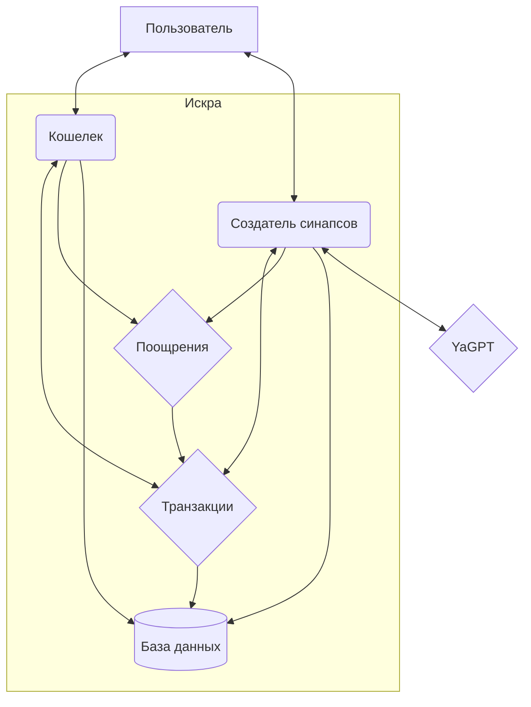

# Техническое задание

Состоит из трех систем:

+ Кошелек пользователя
+ Система транзакций
+ Система поощрений

Подразумевается, что у нас есть некая система, которая пишет тексты по запросу. В данном случае она пишет только синапсы. И для упрощения всегда будет возвращать только один текст. То есть сама система будет выражена `стэбом`, а вся работа будет крутиться вокруг аккаунта и кошелька.

За референс было взято задание `Практикума`, где вместо бонусных баллов некая виртуальная валюта, типа `пыльца`, или я не знаю, кристаллы, монетки. Можно пополнять счет при помощи `промокодов`.



## Система виртуальной валюты для Нейросетевого помошника писателя "Искра"

Система представляет собой `HTTP API` со следующими требованиями к бизнес-логике:

+ регистрация, аутентификация и авторизация пользователей;
+ ведение счета зарегистрированного пользователя;
+ пополнение счета при помощи промокода;
+ просмотр последних операций по счету;

Промокоды являются самопроверяемыми, то есть никакой базы промокодов не будет. Расшифровывая промокод, мы получаем количество баллов, в нем зашифрованное.

### Cхема взаимодействия с системой

+ Пользователь регистрируется в системе «Искра»
+ Пользователь вводит промокод
+ Система валидирует содержание промокода и связывает промокод с пользователем.
+ При успешном выполнении запроса производится начисление баллов на счет пользователя.
+ Пользователь использует баллы для выполнения нейросетевых запросов. Некоторые виды запросов требуют положительного баланса счета.
+ Пользователь смотрит баланс своего счета

### Сводное API

+ `POST /api/user/register` регистрация пользователя
+ `POST /api/user/login` аутентификация пользователя
+ `GET /api/user/balance` посмотреть баланс счета
+ `GET /api/user/balance/check` посмотреть операции по счету

+ `POST /api/user/promo` пополнение баланса счета пользователя промокодом

#### Регистрация пользователя

Хендлер: `POST /api/user/register`

Регистрация производится по паре логин/пароль. Каждый логин должен быть уникальным.

После успешной регистрации должна происходить автоматическая аутентификация пользователя.

Для передачи аутентификационных используется механизм cookies или HTTP-заголовок `Authorization`.

Формат запроса:

```http
POST /api/user/register HTTP/1.1
Content-Type: application/json
...

{
    "login": "<login>",
    "password": "<password>"
}
```

Коды ответа:

+ `200` пользователь успешно зарегистрирован
+ `400` неверный формат запроса
+ `409` логин уже занят
+ `500` внутренняя ошибка сервера

#### Аутентификация пользователя

Хендлер: `POST /api/user/login`

Аутентификация производится по паре логин/пароль.

Для передачи аутентификационных данных используется механизм cookies или HTTP-заголовок `Authorization`.

```http
POST /api/user/register HTTP/1.1
Content-Type: application/json
...

{
    "login": "<login>",
    "password": "<password>"
}
```

Коды ответа:

+ `200` пользователь аутентифицирован
+ `401` неверная пара логин/пароль
+ `400` неверный формат запроса
+ `500` внутренняя ошибка сервера

#### Получение баланса пользователя

Хендлер: `/api/user/balance`

Доступен только аутентифицированному пользователю, в ответе содержится баланс пользователя

Формат запроса

```http
GET /api/user/balance HTTP/1.1
Content-Length:0
```

Коды ответа

+ `200` успешная обработка

    Формат ответа

    ```http
      200 OK HTTP/1.1
      Content-Type: application/json

      {
        "balance": 150
      }
    ```

+ `401` пользователь не авторизован
+ `500` внутренняя ошибка сервера

#### Получение операций по счету

Хендлер: `/api/user/balance/check`

Доступен только аутентифицированному пользователю, в ответе содержится история операций.

Каждая операция имеет некую подпись - что это и зачем надо

Формат запроса

```http
GET /api/user/balance/check HTTP/1.1
Content-Length:0
```

Коды ответа

+ `200` успешная обработка

    Формат ответа

    ```http
      200 OK HTTP/1.1
      Content-Type: application/json

      [
        {
            transationId: 12831923,
            message: "Ежедневное посещение",
            value: 1
        },
        {
            transationId: 12812313,
            message: "списание за использование помощника за сутки",
            value: -12
        },
      ]
    ```

+ `204` нет данных для ответа
+ `401` пользователь не авторизован
+ `500` внутренняя ошибка сервера

#### Активация промокода

Хендлер: `/api/user/promo`

Доступен только аутентифицированному пользователю. Промокодом является строка любой длинны. Номер заказа может быть проверен на валидность при помощи несимметричного алгоритма шифрации. Внутри содержится структура данных с датой истечения и суммой пополнения.

В ответе мы получаем сумму пополнения

Формат запроса

```http
GET /api/user/balance/check HTTP/1.1
...

ASALD1231-123o9dskfni7123-12o38172o3jsd
```

Коды ответа

+ `200` успешная обработка

    Формат ответа

    ```http
      200 OK HTTP/1.1
      Content-Type: application/json

      {
        status: 'success',
        withdraw: 200, 
        message: 'Успешно пополнено на 250 баллов'
      }
    ```

+ `207` уже был загружен
+ `400` неверный формат запроса
+ `401` пользователь не авторизован
+ `409` уже использован другим пользователем
+ `422` неверный формат промокода
+ `500` внутренняя ошибка сервера

### Конфигурирование сервиса

Сервис поддерживает конфигурирование следующими методами

+ адрес и порт сервиса: переменная окружения `RUN_ADRESS` или флаг коммандной строки `-a`
+ адрес подключения к БД: переменная окружения `DATABASE_DSN` или флаг коммандной строки `-d`
+ адрес системы транзакций: переменная окружения `TRANSACTIONS_SYSTEM_ADRESS` или флаг коммандной строки `-t`

## Система транзакций

Внутренний сервис, который недоступен из интернета, или проверяет запросы на правильную подпись

### Общие требования к системе транзакций

+ Аутентифицирует подключающийся сервис
+ ведет внутренний счет: пополнение/ списание
+ выдает справку об операциях

### Сводный API(gRPC)

+ `POST /api/transaction` пополнить/списать со счета
+ `GET /api/balance/{ID}` посмотреть баланс
+ `GET /api/balance/{ID}/transactions/` получить транзакции

## Система поощрения пользователя

Отслеживает события в системе и пополняет счет пользователя, при возникновении определенных условий

### Схема работы

+ За каждое ежедневное посещение пользователь получает 10 баллов
+ За каждое посещение семь дней подряд пользователь получает ещё 50 баллов
+ За каждый запрос к текстовому помощнику пользователь получает 1 балл

## Нейросетевой помощник

Позволяет написать синопсис по указанному текстовому описанию

### Общие требования

+ Позволяет написать синопсис произведения по текстовому описанию
+ При выполнении запросов списывает у пользователя со счета баллы
+ Если баллов менее ста, отказывает в запросе

### Схема взаимодействия с пользователем

+ Пользователь аутентифицируется в системе
+ Пользователь отправляет запрос на генерацию теста, система проверяет баланс пользователя и если он положительный, то выполняет запрос.
+ Если запрос выполнился, то возвращает запрос и списывает со счета пользователя баллы.

### Сводное API

+ `POST /api/wizard/synapse`

## Конкуренты

+ [ghostwriter](https://ghostwriter-ai.com/)
+ [retr.me](https://rytr.me)
+ [copy.ai](https://www.copy.ai)
+ [anyword](https://anyword.com)

## Наши преимущества

+ Нативно использует русский язык
+ Заточен именно под писателей

## Писательские запросы

Чтобы лучше понять, что мы будем делать мы провели опрос среди десяти писателей о их болях при написании текстов и вот какие ответы мы получили:

## TODO

1. [ ] Могут ли нам на курсах выбить аккаунт для гпт, вообще для облака. У меня в целом есть свой.
2. [ ] Можно ли использовать `YDB`, в режиме sql. И надо ли оно вообще?
3. [ ] Кто ЦА? Писатели, или те, кто хотят писать но боятся.
